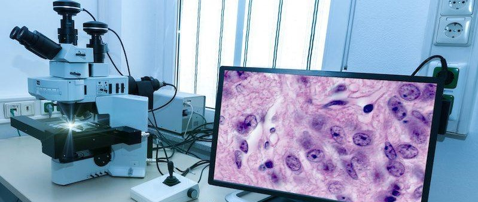
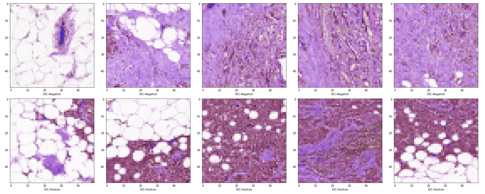
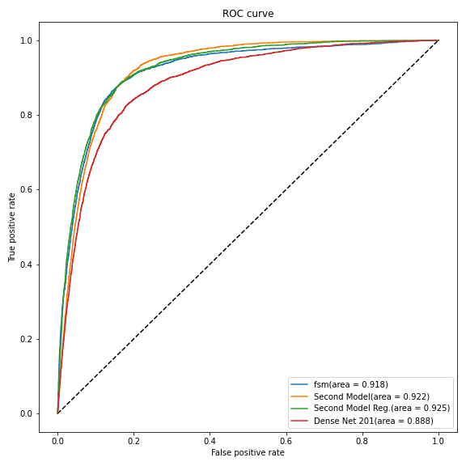
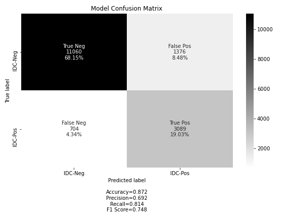
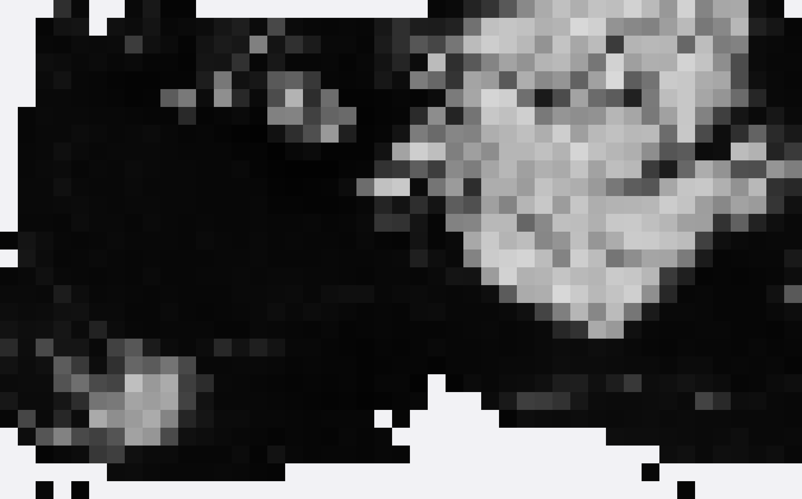

# Convolutional Neural Network for Classification of Breast Cancer Cells

### **Authors**: Aaron Cherry


 
## Overview

The purpose of this study is to train a Convolutional Neural Network (CNN) to identify and classify cancerous cells in needle biopsy images. The aim is to develop a model that distinguishes cancerous regions from non-cancerous regions in whole slide images (WSI) of invasive ductal carcinoma (IDC).

## Problem Statement

> Around the world, breast cancer annually affects about 1.7 million women. Compared to other
types of cancer, it is the highest recurrent cause of death. Based on collected data by the American
Cancer Society, approximately 268,600 new cases were diagnosed as invasive breast cancer patients
in 2019. In the same year, there were approximately 62,930 new cases of in-situ breast cancer identified,
with roughly 41,760 expected death cases due to breast cancer. Early diagnosis of breast cancer is
significant as a means to boost the number of survivors. The high cost of breast cancer diagnosis and
high morbidity have motivated researchers to explore solutions to develop more precise models for
cancer diagnosis.
~ Alzubaidi et. al. electronics (2019)

The screening and testing process for breast cancer is a long and expensive one. A process that can be augmented by the utilization of Machine Learning and deep neural network models. The importance of implementing CNNs in this field is epitimized by the number of models built and the teams working on the issue such a Google, MIT, and international cooperative efforts like [this study](https://www.mdpi.com/2079-9292/9/3/445). These models include [AlexNet](https://en.wikipedia.org/wiki/AlexNet), [GoogleNet](https://towardsdatascience.com/deep-learning-googlenet-explained-de8861c82765), [ResNet](https://arxiv.org/abs/1512.03385), and [DenseNet](https://arxiv.org/abs/1608.06993). Although there have been many different efforts in research on this specific problem, there are still barriers to deploying working models in the field, mostly building a trust in the community to use such models in machine aided pathology which can be solved by showing results of high accuracy and consistancy in the Neural Networks that have been developed.

The following report outlines preliminary work on a Convolutional Neural Network (CNN) designed to predict cancerous regions in Whole Slide Images (WSI). The work underlined in this technical report does not aim to produce better results than models developed by research groups listed above, but to present a light weight solution designed for quick implementation. As a proof of concept, the best model, found through the CRISPR process is used in a web application (repo found [here](https://github.com/JCherryA050/cnn_dp_app)) that functions as a preliminary construct for use in the field. The aim of applying Neural Networks to digital pathology is to aid in the process by vetting the massive amounts of whole slides seen by technicians to facilitate the process. Thus, the model proposed will vet on whole slide based on the portion of patches with a high probability of a positive classification.

## Data



The data used in this study comes from Kaggle and can be found [here](https://www.kaggle.com/paultimothymooney/breast-histopathology-images). The data consisits of 162 whole mount slide images of Breast Cancer (BCa) specimens scanned at 40x. The images were then split into 50x50 pixel patches giving 277,524 patches in total. The patches are classified as '0' for IDC-negative and '1' for IDC-positive. The classification process is done through conventional analysis and is based on common features such as count (e.g., mitotic events), segmentation (e.g., nuclei), and tissue classification (e.g., cancerous vs. non-cancerous). An outline of the process and some pitfalls of the analysis technique can be found in [this](https://www.ncbi.nlm.nih.gov/pmc/articles/PMC4977982/) publication. The file naming convention is as follows:

> Each patch’s file name is of the format: uxXyYclassC.png — > example 10253idx5x1351y1101class0.png . Where u is the patient ID (10253idx5), X is the x-coordinate of where this patch was cropped from, Y is the y-coordinate of where this patch was cropped from, and C indicates the class where 0 is non-IDC and 1 is IDC.
~ Kaggle Source

The files are contained in a directory system separated by whole slide scan with subdirectories separating the files into 0-IDCnegative, and 1-IDCpositive.

## Models

The models trained in this study range from simplistic to somewhat complex and include a pre-trained model loaded from the Keras libraries. The considered models are:

- First Simple Model
- Second Model
- Second Model with L2 regularizations
- Dense Net 201

All models use the Adam optimizer with a ```binary_crossentropy``` loss function and a learning rate of 1e-5. The accuracy and loss of the model was analyzed for each model to ensure convergence of weights.


### Results



The best model was the regularized second model with three hidden layers and L2 regularization as shown in the ROC-curve comparisons above. The predicions made from the model are confidence values of the image being classified as IDC-Positive. The cutoff is skewed left to optimize on the Recall of the model as falsely predicting IDCnegative presents the most risk to patients. The cutoff for binary classification is 0.25 and the confidence matrix for the model below was made with this cutoff value.



The Recall is optimized at ____ with some sacrifice in the accuracy of the model. Again, this is a reasonable tradeoff as, in practice, a false positve represents less of a risk and can easily be corrected with a trained eye. An example of the predictions made with the best model are displayed below. The model performs well in predicting IDC-Positive areas as cancerous, however falsly pedicts some non-cancerous regions as IDC-positive. The model seems to be overly color sensitive and fails to pick up on more minute details of cancerous regions. Future work will include reducing the sensitivity of the model and added complexity.




## Conclusions

A Convolutional Neural Network is proposed for the identification of cancerous regions of whole slide stained biopsy images. Through iteration, the best model performed well with an accuracy of 87.5% and an AUC of 0. The final model was used to predict cancerous regions in an example WSI and was shown to perform well, predicting cancerous regions of the WSI however also giving false positive predictions of non-cancerous regions. This model, however is used as a preliminary screening and the over sensitivity of the model becomes less of an issue when followed up with conventional analysis.

## Next Steps

Model Optimization:
The model shows promise in detecting cancerous regions in WSI analysis, however it is shown to be overly sensitive and falsly predicts IDC-Negative regions in the WSI. Fuuture steps include added complexity of the model to distinguish between these two regions. Future work would benefit from expert feedback and added domain knowlege. The models used in this study are also simplistic in design and may not work well in defining more complex features of the images such as the [nuclear morphology](https://www.ncbi.nlm.nih.gov/pmc/articles/PMC4977982/). Future work would include implementing models with an emphasisis on distinguishing more complex features of cancerous cells.

Predicting Cancer Type:
Invasive Ductal Carcinoma is one of for types of malignant cancer. Other malignant cancer types include lobular carcinoma, mucinous carcinoma, and papillary carcinoma. Benign cancers also exist such as adenosis, ficroadenoma, phyllodes tumors, and tubular adenoma. Future work will be dedicated to building more complex models to differentiate between the cancerous types as well as defining cancerous regions within WSIs of each type. For this analysis, data from the [BreakHis](https://www.kaggle.com/ambarish/breakhis) database can be used and contains WSIs of each of the types listed. The data would, however, need to be augmented with images showing only normal tissue. 

## Repository Contents

Below is a list of the contents of this repository - instructions for using them are in the next section.

- `README.md`: The README for this repo branch explaining it's contents
- `technical_report.ipynb`: Full technical report of the study, results, conclusions, and next steps
- `phase_5_nontechnical.pdf`: A starter slide deck presenting your project - here is an [editable version](https://docs.google.com/presentation/d/1ANYVs-CsPnfNA2bvQ-8mNlD9GpgZbI9_nY7lcUvdZfY/edit#slide=id.p)
- `data` Folder: The folder containing the data referenced in the code (this is not included in the repo but can be downloaded from [here](https://www.kaggle.com/paultimothymooney/breast-histopathology-images))
- `images` Folder: contains the images referenced here and the non technical presentation
- `.gitignore`: Hidden file that includes the directories and files not included in this repo
- `src`: Folder: contains the plotting code used in the technical report
- `models`: Folder: contains the pretrained models used in this study
- `notebooks`: Folder: contains all of the working notebooks used for data preprocessing, training models, and post-processing results
- `test`: Folder: contains whole slide and patch data used in the model predictions section in the technical report

## Instructions For Using This Repository

### Fork This Repository

**For a group project**, have only one team member do these steps:

1. Fork this repository to your personal account
   - In GitHub, go to this repository and click the "Fork" button in the upper right
   
2. Change the name of your fork of this repo to a _descriptive_ name of your choosing
   - In GitHub, go to your fork of this repo -> "Settings" -> "Options" -> "Repository Name" -> "Rename"

3. Use `git clone` to clone your fork of this repo to your local computer

4. Make a `data/` folder using `mkdir data`, download the data from here [Kaggle](https://www.kaggle.com/paultimothymooney/breast-histopathology-images), and unzip the folder using `unzip file.zip -d destination_folder`

## Repository Structure

```
├── notebooks
│   ├── densenet201.ipynb
│   ├── directory_org_EDA.ipynb
│   ├── divide_and_patch.ipynb
│   ├── image_concat.ipynb
│   └── fsm_notebook.ipynb
├── data
├── images
├── src
│   ├── eval_plots.py
│   ├── whole_slide_process.py
│   └── train_model.py
├── __init__.py
├── README.md
├── nontechnical_presentation.pdf
└── technical_report.ipynb
```
